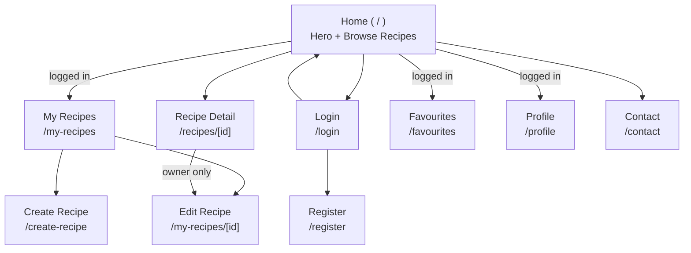

# Design.md — Modern Recipe Website (Frontend Design System)

This document defines the visual language, components, and page-level designs for the Recipe MERN frontend. It is **strictly scoped to what the existing backend actually returns and accepts** (see `PRD.md` for the full API contract). No screen, component, or interaction described here implies a backend capability that doesn't exist today. Section 12 lists everything intentionally excluded and why.

---

## 1. Design Principles

1. **Food-first visuals, content-second chrome.** Recipe photography is the hero of every card and detail page; UI chrome (borders, shadows, labels) stays quiet and gets out of the way.
2. **Warm, appetite-driven palette.** A single confident accent (orange) carries all calls-to-action and brand moments — no competing accent colors.
3. **Honest data.** Never display a field the backend doesn't provide (e.g. no author name on cards — see §11). Empty/optional fields degrade gracefully instead of showing "undefined" or broken layout.
4. **Fast to scan, fast to cook.** Recipe detail layout prioritizes ingredients and steps above the fold on desktop; numbers (time, servings) are visually distinct so a cook can glance mid-task.
5. **Consistent primitives.** Every page is built from the same small component set (§6) — no page invents its own button, input, or card style.

---

## 2. Design Tokens

### 2.1 Color

| Token | Tailwind class | Hex | Usage |
|---|---|---|---|
| `primary` | `orange-400` | `#FB923C` | Primary buttons, active nav state, links, accents |
| `primary-hover` | `orange-500` | `#F97316` | Hover/active state of primary elements |
| `primary-subtle` | `orange-50` | `#FFF7ED` | Chip backgrounds, subtle icon badges, hover surfaces |
| `ink-900` | `gray-900` | `#111827` | Headings, primary text, footer background |
| `ink-700` | `gray-700` | `#374151` | Body copy |
| `ink-500` | `gray-500` | `#6B7280` | Secondary/muted text, placeholders, captions |
| `ink-300` | `gray-300` | `#D1D5DB` | Footer text on dark background |
| `line-200` | `gray-200` | `#E5E7EB` | Borders, dividers |
| `surface` | `white` | `#FFFFFF` | Page background, card background |
| `surface-muted` | `gray-50` | `#F9FAFB` | Section backgrounds, input hover fill |
| `success` | `green-500` | `#22C55E` | "Easy" difficulty badge |
| `warning` | `amber-500` | `#F59E0B` | "Medium" difficulty badge |
| `danger` | `red-500` | `#EF4444` | "Hard" difficulty badge, destructive actions, form errors |

Difficulty badge color mapping is a frontend presentation decision (the backend only stores the enum string `easy | medium | hard`; color-coding is purely visual).

### 2.2 Typography

Font stack already wired in `app/layout.tsx`: **Geist Sans** (primary), **Geist Mono** (numeric/mono accents), falling back to `Arial, Helvetica, sans-serif` per `globals.css`.

| Role | Size / Line-height | Weight | Example use |
|---|---|---|---|
| Display | 36px / 44px (`text-4xl`) | 700 | Hero headline |
| H1 | 30px / 38px (`text-3xl`) | 700 | Page titles (Login, Profile, Recipe name on detail) |
| H2 | 24px / 32px (`text-2xl`) | 700 | Section headings, recipe card name |
| H3 | 20px / 28px (`text-xl`) | 600 | Modal titles, sub-section headings |
| Body | 16px / 24px (`text-base`) | 400 | Paragraph copy, form labels |
| Small | 14px / 20px (`text-sm`) | 400 | Meta text, helper text, captions |
| Micro | 12px / 16px (`text-xs`) | 500, uppercase, tracked | Badges, eyebrow labels (e.g. role tag on Profile) |

Numeric stats (prep time, cook time, servings, rating, views) use **Geist Mono** with `tabular-nums` to keep digits visually aligned in cards.

### 2.3 Spacing & Layout

- Base unit: 4px (Tailwind default scale).
- Page content max-widths: `max-w-6xl` (browse grids, home), `max-w-3xl` (forms, detail body, profile), `max-w-sm` (auth forms).
- Standard vertical rhythm between page sections: `py-12` to `py-16`.
- Navbar height: fixed `h-[72px]` equivalent (`px-10 py-4` current implementation), content padded `pt-24` below to clear the fixed navbar (already the pattern in existing pages).

### 2.4 Radius & Elevation

| Token | Class | Used for |
|---|---|---|
| `radius-sm` | `rounded-lg` (8px) | Buttons, inputs, chips |
| `radius-md` | `rounded-xl` (12px) | Recipe cards, image containers |
| `radius-lg` | `rounded-2xl` (16px) | Modals, profile card, form panels |
| `radius-full` | `rounded-full` | Avatars, logo mark, icon buttons, difficulty dot |
| `shadow-sm` | `shadow-sm` | Resting cards, navbar |
| `shadow-md` | `shadow-lg` | Dropdown menus, hover-elevated cards |
| `shadow-lg` | `shadow-xl` | Recipe card image (matches existing `RecipeList` styling) |

### 2.5 Motion

- Standard transition: `transition-colors duration-300` for hover states (links, buttons) — matches existing Navbar/Footer code.
- Structural transitions (borders, layout shifts): `transition-all duration-300 ease-in-out`.
- Modals: fade + scale-in, 150–200ms, backdrop fade 200ms.
- Toasts: slide-in from top-right or bottom-right, 200ms in / 150ms out, auto-dismiss after 3.5s.
- Respect `prefers-reduced-motion`: disable non-essential transitions (hero SVG animation, toast slide) when set.

---

## 3. Iconography

Uses `react-icons` (already a dependency), primarily the `hi2` (Heroicons 2) set already in use (`HiHeart`, `HiOutlineHeart`).

| Icon | Source | Meaning |
|---|---|---|
| `HiHeart` / `HiOutlineHeart` | favourited / not favourited toggle |
| `HiOutlineClock` | prep time / cook time |
| `HiOutlineUserGroup` | servings |
| `HiOutlineChartBar` or dot indicator | difficulty |
| `HiOutlineEye` | views count |
| `HiOutlineStar` / `HiStar` | rating display (read-only, see §11) |
| `HiOutlinePencil` | edit action |
| `HiOutlineTrash` | delete action |
| `HiOutlineMagnifyingGlass` | search input |
| `HiOutlineXMark` | close modal / remove chip / clear search |
| `HiChevronDown` | dropdown affordance (user menu, filters) |
| `HiBars3` / `HiXMark` | mobile nav open/close |

---

## 4. Information Architecture

Every route is reachable from the persistent Navbar except Register (linked from Login) and recipe detail/edit (linked from cards).

---

## 5. Layout & Grid

- **Breakpoints:** Tailwind defaults — `sm` 640px, `md` 768px, `lg` 1024px, `xl` 1280px.
- **Recipe grid:** 1 column (mobile) → 2 columns (`sm`/`md`) → 3 columns (`lg+`), replacing the current hard-coded `grid-cols-3` so small screens don't overflow.
- **Detail page:** single column on mobile; two-column on `lg+` (image + meta sidebar on the left/top, ingredients + instructions on the right/main on desktop, or stacked full-width on mobile — image always first).
- **Forms:** single column, `max-w-3xl`, centered, generous label/field spacing (`gap-5`).
- **Navbar:** persistent, fixed top, full-width, condenses to a hamburger menu below `md`.

---

## 6. Core Components

### 6.1 Navbar
- Logo (left) · primary links (Home, Favourites, My Recipes, Contact) · auth area (right): "Login" button when logged out, avatar-initial + name dropdown (Profile, Logout) when logged in.
- Active route gets the existing pill treatment: `border border-orange-300 text-orange-500`.
- Below `md`: links collapse into a slide-down/hamburger menu; auth area stays visible.
- Protected links (Favourites, My Recipes) redirect to `/login` on click when logged out (existing behavior), and the target route itself is also guarded on direct load (see `tasks.md` M5).

### 6.2 Footer
- Brand mark + name (left), copyright line (bottom bar) — matches current implementation. No link list needed beyond what's already global-navigable via Navbar.

### 6.3 Hero (Home only)
- Full-bleed section with the existing animated SVG wave background in `primary` tones.
- Headline ("Discover & Share Recipes"), one-line subhead, two CTAs: **Browse Recipes** (scrolls to grid, or `#recipes` anchor) and **Add Your Recipe** (`/create-recipe`, redirects to login first if logged out).

### 6.4 Button
Variants, all `radius-sm`, `transition-colors duration-300`:
| Variant | Style | Use |
|---|---|---|
| Primary | `bg-orange-400 text-white hover:bg-orange-500` | Submit, primary CTA |
| Secondary | `border border-gray-300 text-gray-700 hover:border-orange-400` | Cancel, secondary action |
| Ghost | transparent, `hover:bg-gray-50` | Inline/table actions (Edit) |
| Danger | `bg-red-500 text-white hover:bg-red-600` | Delete confirm |
| Icon | square, `rounded-full`, transparent/hover `bg-orange-50` | Favourite toggle, close modal |

States: default, hover, focus-visible (`ring-2 ring-orange-300`), disabled (`opacity-50 cursor-not-allowed`), loading (spinner replaces label, button stays same width).

### 6.5 Input / Textarea / Select
- Shared style: `rounded-lg border border-gray-300 px-4 py-2 outline-none focus:border-orange-400 focus:ring-1 focus:ring-orange-300` (extends the existing Login input style).
- Label above field, small helper/error text below (`text-sm text-red-500` for errors, `text-sm text-gray-500` for helper).
- Number inputs (prepTime, cookTime, servings, ingredient quantity) use `type="number"` with `min` matching backend constraints (0 for times, 1 for servings, >0 for quantity).
- Select (difficulty) uses the three fixed backend enum values only: Easy / Medium / Hard.

### 6.6 Recipe Card
Anatomy (top to bottom):
1. Image (16:10 container, `object-cover`, `rounded-xl`, `shadow-xl`) with a fallback food-icon placeholder + `bg-gray-100` if the URL fails to load (`onError`).
2. Favourite icon button, top-right corner overlay on the image (filled heart if favourited, outline otherwise) — hidden/disabled with a tooltip prompting login when logged out.
3. Difficulty badge, top-left corner overlay (colored dot + label per §2.1).
4. Title (H2, `name`).
5. Brief (`brief` field — **never** `description`, which is reserved for the detail page).
6. Meta row: prep+cook time (clock icon, sum or "Prep X · Cook Y"), servings (people icon), category (text chip).
7. Entire card is a `Link` to `/recipes/[id]`.

### 6.7 Badge / Chip
- Difficulty badge: colored dot + capitalized label, `rounded-full px-2.5 py-0.5 text-xs font-medium`, background = subtle tint of its color (e.g. `bg-green-100 text-green-700` for Easy).
- Tag chip (read-only, on detail page, and input chip on Create/Edit forms): `rounded-full bg-orange-50 text-orange-600 px-3 py-1 text-xs`.
- Category chip: neutral `bg-gray-100 text-gray-700`.

### 6.8 Modal
- Centered, `radius-lg`, `shadow-xl`, backdrop `bg-black/40`.
- Used for: delete-recipe confirmation, delete-account confirmation, (optionally) edit-name / change-password if not done inline.
- Structure: title (H3), body copy, footer with Secondary (Cancel) + Danger or Primary (Confirm) buttons, close (`X`) icon top-right.

### 6.9 Loader
- Inline centered spinner (accent-colored ring) + optional label ("Loading recipes…"). Used for full-page loads and in-place list loads.

### 6.10 EmptyState
- Icon (contextual: heart outline for empty favourites, book/plate outline for no recipes yet), short headline, one-line supporting copy, optional CTA button (e.g. "Browse Recipes" on empty Favourites, "Create your first recipe" on empty My Recipes).

### 6.11 ErrorMessage
- Inline banner style: `rounded-lg border border-red-200 bg-red-50 text-red-600 px-4 py-3 text-sm`, used for form-level and fetch-level errors (e.g. failed login, failed recipe load).

### 6.12 Toast (optional, from `tasks.md` M0/M6)
- Compact rounded card, top-right stack, colored left border (green = success, red = error), auto-dismiss with a thin progress bar.

### 6.13 Ingredient Row (Create/Edit form)
- Three inline fields per row: Name (text, flexible width), Quantity (number, narrow), Unit (text, narrow, optional) + a remove icon button; "Add ingredient" ghost button below the list.

### 6.14 Instruction Step (Create/Edit form)
- Numbered step (auto-incrementing badge), multiline text field, remove icon button; drag handle optional for reordering; "Add step" ghost button below the list.

### 6.15 Avatar
- Circle (`rounded-full`), shows `user.image` if present, otherwise the user's initial letter on a `bg-orange-100 text-orange-600` circle (since `image` is optional/nullable per the `User` model).

---

## 7. Page Designs

### 7.1 Home (`/`)
**Layout:** Navbar → Hero → "All Recipes" section → Footer.
**Recipes section:**
- Section heading "All Recipes" + a search input (icon-prefixed) and two filter dropdowns (Category, Difficulty) inline on desktop, stacked on mobile.
- Search/filters operate **client-side only** over the single `GET /api/recipe` response (no backend query params exist).
- Grid of Recipe Cards (§6.6) below.
- States: `Loader` while fetching, `EmptyState` ("No recipes match your search" / "No recipes yet") when the filtered list is empty, `ErrorMessage` if the fetch fails.

### 7.2 Login (`/login`)
- Centered `max-w-sm` card-less form (current style): H1 "Login", email input, password input, inline `ErrorMessage` on failure, Primary submit button, footer link "Don't have an account? Register".

### 7.3 Register (`/register`)
- Same shell as Login: H1 "Register", inputs for Name, Email, Password, Confirm Password, client-side validation errors under each field, Primary submit, footer link "Already have an account? Login".
- On success, auto-login and redirect to `/` (per PRD §4.1.1).

### 7.4 Recipe Detail (`/recipes/[id]`)
**Above the fold (desktop, two columns / mobile, stacked):**
- Left/top: full-width hero image (`rounded-2xl`, fallback placeholder on error), favourite button overlay.
- Right/below on mobile: Title (H1, `name`), difficulty badge + category chip, meta strip with icons — Prep time, Cook time, Servings, Views, Rating (★ `rating` / 5, "`ratingsCount` ratings") — **all read-only, no rating submission UI** (see §11).
- Brief (`brief`) as an intro line under the title.

**Body:**
- "Description" section (only rendered if `description` is present — it's optional).
- "Ingredients" section: bulleted list, each line `quantity unit name` (e.g. "2 cups flour"; omit unit gracefully if absent).
- "Instructions" section: numbered ordered list rendered from the `instructions[]` array, one step per list item.
- "Tags" section (only rendered if `tags.length > 0`): tag chips.

**Owner actions:** if `recipe.owner === currentUser.id` (string compare against `AuthContext` user id — no author name is fetched or shown for other users' recipes, since the backend doesn't populate `owner`), show Edit + Delete buttons near the title, linking to `/my-recipes/[id]` and opening the delete confirmation modal respectively.

**States:** `Loader` while fetching; dedicated 404 illustration/copy ("Recipe not found") if the backend returns 404.

### 7.5 Create Recipe (`/create-recipe`)
- H1 "Create a Recipe", single-column form, `max-w-3xl`, grouped into visual sub-sections with H3 sub-headings:
  1. **Basics** — Name, Brief, Description (textarea), Image URL, Category, Difficulty (select), Tags (chip input).
  2. **Timing & Yield** — Prep Time (min), Cook Time (min), Servings — three inputs in a row on desktop, stacked on mobile.
  3. **Ingredients** — repeatable Ingredient Rows (§6.13).
  4. **Instructions** — repeatable Instruction Steps (§6.14).
- Sticky footer action bar (desktop) or bottom-fixed bar (mobile) with Secondary "Cancel" and Primary "Publish Recipe" buttons.
- Inline field errors mirror `CreateRecipeSchema` constraints exactly (min/max lengths, URL format, min 1 ingredient/instruction, numeric minimums).
- Route requires auth (redirect to `/login` if not authenticated).

### 7.6 My Recipes (`/my-recipes`)
- H1 "My Recipes" + Primary "Add Recipe" button (top-right, → `/create-recipe`).
- Same Recipe Card grid as Home, but each card additionally shows Ghost "Edit" and icon "Delete" actions (delete opens confirmation Modal).
- `EmptyState`: "You haven't created any recipes yet" + "Create your first recipe" CTA.

### 7.7 Edit Recipe (`/my-recipes/[id]`)
- Identical form layout to Create Recipe (§7.5), reusing the same `RecipeForm` component, pre-filled from `GET /api/recipe/:id`.
- H1 "Edit Recipe"; footer action bar has Secondary "Cancel", Danger "Delete Recipe" (opens confirmation Modal), Primary "Save Changes".
- If the current user does not own the recipe, redirect away (no read-only owner view needed here — that's what the public detail page is for).

### 7.8 Favourites (`/favourites`)
- H1 "Favourites", same Recipe Card grid (favourite icon always filled here since every card is, by definition, favourited), one-click unfavourite directly from the card.
- `EmptyState`: heart-outline icon, "No favourites yet", CTA "Browse Recipes" → `/`.

### 7.9 Profile (`/profile`)
- Centered `max-w-xl` Card containing:
  - Avatar (§6.15), Name (H2), Email (body, read-only — not editable per backend constraint), Role micro-badge (uppercase, tracked, subtle background).
  - **Edit name** control (inline pencil icon next to name → small inline form or Modal with a single Name field → `PATCH /api/user`).
  - **Change password** section: collapsible/expandable form with Old Password, New Password, Confirm New Password → `PUT /api/user/password`; on success shows a message and redirects to `/login` (session invalidated server-side).
  - **Delete account** — Danger ghost link at the bottom of the card, opens confirmation Modal before calling `DELETE /api/user`.
- No email/image editing controls anywhere on this page (backend does not accept them).

### 7.10 Contact (`/contact`)
- Keep the current static hero + "Call Us" / "Email Us" contact-method layout (already well-designed). No form submission UI, since there is no backend endpoint to receive it — optionally make the email row a `mailto:` link with a pre-filled subject for convenience.

### 7.11 Not Found / 404
- Centered illustration or icon, "Page not found" heading, Primary button back to Home. Applies both to unmatched routes and to a recipe id that returns 404 from the API (contextual copy differs slightly: "Recipe not found" vs "Page not found").

---

## 8. States & Feedback Patterns

| State | Pattern |
|---|---|
| Loading (full page) | Centered `Loader` below Navbar |
| Loading (in-place list) | `Loader` where the grid/list will render, rest of chrome stays visible |
| Empty | `EmptyState` component, contextual icon/copy/CTA per page (see §7) |
| Error (fetch) | `ErrorMessage` banner in place of content, with a "Try again" Secondary button where feasible |
| Error (form field) | Small red text directly under the offending field, field border turns `border-red-400` |
| Error (form submit) | `ErrorMessage` banner above the submit button, using the backend's `message` string verbatim |
| Success (mutation) | Toast notification (create/update/delete recipe, profile update, favourite toggle) — favourite toggle itself needs no toast since the icon state change is sufficient feedback |
| Destructive confirm | Modal, always required before DELETE calls (recipe, account) — never a bare `window.confirm` |

---

## 9. Responsive Behavior

- **Navbar:** hamburger menu below `md`; auth avatar/login button always visible regardless of breakpoint.
- **Recipe grid:** 1 → 2 → 3 columns at `sm`/`lg` as defined in §5.
- **Recipe detail:** two-column desktop layout collapses to a single stacked column below `lg`, image always first.
- **Forms (Create/Edit Recipe):** ingredient/instruction rows stack their sub-fields vertically below `sm` instead of inline.
- **Modals:** full-width with margin on mobile (`mx-4`), fixed max-width (`max-w-md`) on larger screens.

---

## 10. Accessibility

- All interactive icon-only buttons (favourite toggle, delete, close modal, mobile menu) require `aria-label`.
- Form inputs have associated `<label>` elements (not just placeholders) — placeholders supplement, never replace, labels.
- Color is never the only signal: difficulty badges pair color with a text label; error states pair red color with icon + text.
- Modals trap focus and close on `Escape`; confirmation buttons are reachable via keyboard without a mouse.
- Maintain WCAG AA contrast: body text `gray-700`+ on white, white text only on `orange-500`+/`gray-900` backgrounds, never `orange-400` text on white for body copy (decorative/link-only use).
- Respect `prefers-reduced-motion` (§2.5).

---

## 11. Backend-Driven Constraints (do not design around missing data)

These are hard constraints from the actual backend implementation and must shape the designs above exactly as described — not idealized versions of them:

1. **No author/owner display on cards or other users' detail pages.** `Recipe.find()` / `Recipe.findById()` in `recipe.service.ts` never `.populate("owner")` — only a raw ObjectId is available. Only compare it against the logged-in user's own id (to decide whether to show Edit/Delete); never attempt to render an owner name, avatar, or "by ___" byline for a recipe you don't own.
2. **No rating submission.** `rating`/`ratingsCount` exist on the `Recipe` model but there is no endpoint or service method that increments/sets them from user input. Display them as static read-only stats; do **not** design a star-rating input/interactive widget.
3. **No view-count increment.** `views` is a stored field but nothing in `recipe.service.ts` increments it. Display it as-is (will show `0` for essentially all recipes today) rather than implying it's a live counter with fresh interaction.
4. **No image upload.** `image` is a plain URL string field (`z.string().url()`); the form must be a URL text input, never a file picker/dropzone. Always design an `onError` fallback for broken/unreachable URLs since nothing validates reachability server-side.
5. **Profile editing is name-only.** `PATCH /api/user` (`UpdateUserSchema`) accepts only `{ name }`. Never design editable email or avatar-upload controls on Profile.
6. **No server-side search/filter/pagination.** `GET /api/recipe` returns the entire collection unconditionally. Search and filter UI must be explicitly client-side over the already-fetched array — do not design "server is searching" loading states for search/filter interactions themselves (only the initial full-list fetch shows a loader).
7. **No categories/tags taxonomy endpoints.** `category` and `tags` are free-text fields on each recipe with no dedicated list endpoint. Filter dropdown options must be derived from values already present in the fetched recipe list, not from a separate "get all categories" call.
8. **No enforced admin role.** `role` exists on `User` but no route currently enforces `authorize("admin")`. Do not design any admin-only screens or controls.
9. **Password change invalidates all sessions.** `changePassword` in `user.service.ts` calls `Session.deleteMany({user: userId})`. The Change Password success flow must always end in a forced logout + redirect to `/login`, never a "stay logged in" success state.
10. **Favourites list is fully populated; recipe lists are not.** `getFavourites` calls `.populate("favourites")`, so Favourite cards can render immediately with full recipe data. `getRecipes`/`getUserRecipes` return plain recipe documents (already complete recipe objects, just without owner population) — no additional fetch is needed per card either way.

---

## 12. Explicitly Out of Scope

Not designed, and should not be added speculatively, because the backend provides no supporting endpoint or field:

- Image/file upload UI (no multer/Cloudinary integration)
- Comments or reviews on recipes (no model/endpoint)
- Interactive star-rating submission (no endpoint)
- Live view-count increments (not implemented server-side)
- Server-rendered/paginated infinite-scroll recipe browsing (no pagination params)
- Category or tag management screens (no dedicated endpoints)
- Admin dashboard / user management UI (no enforced authorization)
- Social login / OAuth (only email+password exists)
- Recipe sharing/collections/meal-planning features (no models for these)
- Contact form that posts to the backend (no endpoint exists — static info or `mailto:` only, per §7.10)

---

## 13. Component-to-Backend Field Map (quick reference)

| UI element | Backend field(s) | Notes |
|---|---|---|
| Card title | `name` | — |
| Card subtitle | `brief` | Never `description` |
| Detail description section | `description` | Optional — hide section if absent |
| Ingredients list | `ingredients[].name/quantity/unit` | `unit` optional per item |
| Instructions list | `instructions[]` (string array) | Rendered as an ordered list, index + 1 = step number |
| Difficulty badge | `difficulty` (`easy\|medium\|hard`) | Enum-fixed, color-mapped per §2.1 |
| Category chip | `category` | Free text |
| Tag chips | `tags[]` | Free text array, may be empty |
| Prep/Cook time | `prepTime`, `cookTime` (minutes) | `cookTime` defaults to 0 |
| Servings | `servings` | Integer ≥ 1 |
| Rating display | `rating`, `ratingsCount` | Read-only, always reflects current DB value (effectively static today, per §11.2) |
| Views | `views` | Read-only (effectively static today, per §11.3) |
| Favourite icon state | membership in current user's `favourites[]` | Sourced from `GET /api/user/favourites` on relevant pages |
| Owner-only actions | `recipe.owner` vs. current user id | String compare only, no author display |
| Profile name/email/role/image | `User.name/email/role/image` | Only `name` is editable |
